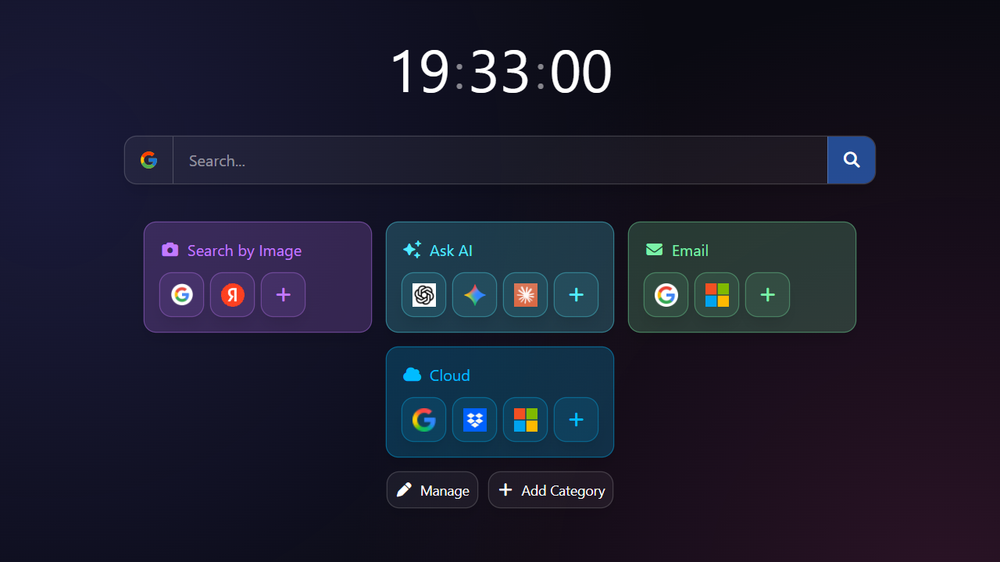

  

<h1 align="center">New Tab X</h1>

  

### Install
-  [Chrome Store](https://chromewebstore.google.com/detail/flmndcndpcchdfnhdbghcjdohacafioc)
-  [Firefox Store](https://addons.mozilla.org/firefox/addon/new-tab-x/)

### Features
- Customizable background
- Search Bar with multiple engines and suggestions
- Organize your Shortcuts into customizable Categories
- Clock widget
- Weather widget
